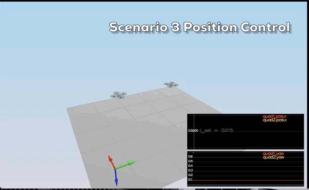

# Building a Controller

## Body rate and roll/pitch control (Scenario 2)

### Performance metrics 

- roll should less than 0.025 radian of nominal for 0.75 seconds (3/4 of the duration of the loop)

- roll rate should less than 2.5 radian/sec for 0.75 seconds

  

  
  

 

## Postion/velocity and yaw angle control (Scenario 3)

### Performance metrics 

- X position of both drones should be within 0.1 meters of the target for at least 1.25 seconds

- Quad2 yaw should be within 0.1 of the target for at least 1 second

  
  

  
  

  

## Non-idealities and robustness (Scenario 4)

### Performance metrics 

- position error for all 3 quads should be less than 0.1 meters for at least 1.5 seconds

  
  

  
  

  

## Tracking trajectories (Scenario 5)

### Performance metrics 

- position error of the quad should be less than 0.25 meters for at least 3 seconds

